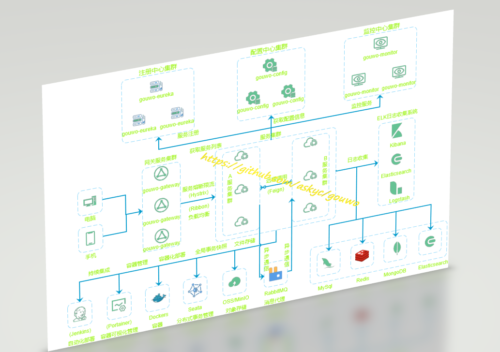

# gouwo


## 项目介绍

`gouwo`是一套微服务租房和生活系统，采用了 Spring Cloud Greenwich、Spring Boot 2、MyBatis-Plus、Docker、Elasticsearch等核心技术，同时提供了基于Vue的app前后端分离应用。`gouwo`基础模块集成了注册中心、网关、配置中心、监控中心等系统功能。  

## 系统架构图



## 组织结构

``` lua
gouwo
├── gouwo-codetool -- 代码生成工具
├── gouwo-common --  工具类及通用代码模块
├── gouwo-security -- 安全模块
├── gouwo-eureka -- 基于Eureka的微服务注册中心
├── gouwo-config -- 基于Spring Cloud Config的微服务配置中心
├── gouwo-gateway -- 基于Spring Cloud Gateway的微服务API网关服务
├── gouwo-monitor -- 基于Spring Boot Admin的微服务监控中心
├── gouwo-turbine -- 微服务集群监控中心
├── gouwo-zipkin -- 分布式链路追踪
├── gouwo-people -- people服务
└── gouwo-house -- house服务
└── gouwo-essay -- essay服务
└── gouwo-vlog -- vlog服务
```


- 后台系统： [https://github.com/Askyc/gouwo](https://github.com/Askyc/gouwo)  
- 移动app：[https://github.com/Askyc/gouwo-app](https://github.com/Askyc/gouwo-app)

## 技术选型

### 后端技术

| 技术             | 说明                 | 官网                                                 |
| ---------------- | -------------------- | ---------------------------------------------------- |
| Spring Cloud     | 微服务框架           | https://spring.io/projects/spring-cloud              |
| Spring Boot      | 容器+MVC框架         | https://spring.io/projects/spring-boot               |
| Spring Security  | 认证和授权框架       | https://spring.io/projects/spring-security           |
| MyBatis-Plus     | ORM框架              | https://mp.baomidou.com       |
| MyBatis-Plus Generator | 数据层代码生成       | https://mp.baomidou.com/guide/generator.html          |
| PageHelper       | MyBatis物理分页插件  | http://git.oschina.net/free/Mybatis_PageHelper       |
| Swagger-UI       | 文档生产工具         | https://github.com/swagger-api/swagger-ui            |
| Elasticsearch    | 搜索引擎             | https://github.com/elastic/elasticsearch             |
| RabbitMq         | 消息队列             | https://www.rabbitmq.com/                            |
| Redis            | 分布式缓存           | https://redis.io/                                    |
| MongoDb          | NoSql数据库          | https://www.mongodb.com/                             |
| Docker           | 应用容器引擎         | https://www.docker.com/                              |
| Druid            | 数据库连接池         | https://github.com/alibaba/druid                     |
| OSS              | 对象存储             | https://github.com/aliyun/aliyun-oss-java-sdk        |
| MinIO            | 对象存储             | https://github.com/minio/minio                       |
| JWT              | JWT登录支持          | https://github.com/jwtk/jjwt                         |
| LogStash         | 日志收集             | https://github.com/logstash/logstash-logback-encoder |
| Lombok           | 简化对象封装工具     | https://github.com/rzwitserloot/lombok               |
| Seata            | 全局事务管理框架     | https://github.com/seata/seata                       |
| Portainer        | 可视化Docker容器管理 | https://github.com/portainer/portainer               |
| Jenkins          | 自动化部署工具       | https://github.com/jenkinsci/jenkins                 |

## 环境搭建

### 开发环境

工具 | 版本号 | 下载
----|----|----
JDK | 1.8 | https://www.oracle.com/technetwork/java/javase/downloads/jdk8-downloads-2133151.html
Mysql | 5.7 | https://www.mysql.com/
Redis | 3.2 | https://redis.io/download
Elasticsearch | 6.2.2 | https://www.elastic.co/downloads
MongoDb | 3.2 | https://www.mongodb.com/download-center
RabbitMq | 3.7.14 | http://www.rabbitmq.com/download.html
nginx | 1.10 | http://nginx.org/en/download.html


## 运行效果展示


[Apache License 2.0]()
